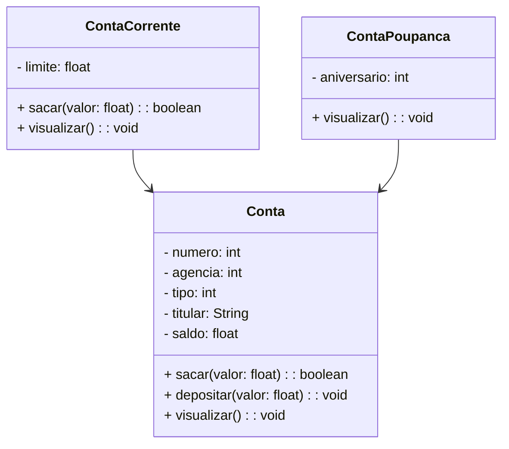

# Projeto Conta Bancária - Java

<div align="center">
	
</div>

<div align="center">
  
  
  
  
  
  
</div>

---

## 1. Descrição

O **Projeto Conta Bancária** é um sistema de gestão projetado para simular e administrar operações financeiras relacionadas a contas bancárias. Oferece funcionalidades como **cadastro**, **consulta**, **atualização** e **remoção** de contas, além de transações como depósitos, saques e transferências.

O projeto foi desenvolvido em **Java**, com foco na aplicação dos principais pilares da **Programação Orientada a Objetos (POO)**:

- Classes e Objetos;
- Atributos e Métodos;
- Encapsulamento;
- Herança;
- Polimorfismo;
- Abstração.

---

## 2. Funcionalidades

1. Criar Conta (Corrente ou Poupança)
2. Listar todas as Contas
3. Consultar Conta por número
4. Consultar Conta por titular
5. Atualizar dados da Conta
6. Excluir Conta
7. Saque
8. Depósito
9. Transferência entre contas

---

## 3. Diagrama de Classes



---

## 4. Menu do Sistema

<div align="center">
   
</div>

---

## 5. Requisitos

- Java JDK 17+
- Eclipse ou STS (Spring Tool Suite)

---

## 6. Como Executar

### Via Git + Eclipse/STS

```bash
git clone https://github.com/EduardoTosta/conta_bancaria.git
```

1. Abra o Eclipse ou STS
2. Vá em `File → Import...`
3. Selecione `General → Existing Projects into Workspace`
4. Escolha o diretório do projeto clonado
5. Finalize e execute a classe `Menu.java`

---

## 7. Contribuições

Este projeto é educacional, mas sugestões e melhorias são bem-vindas!  
Você pode:

- Criar uma issue
- Fazer um fork e abrir um pull request
- Compartilhar com colegas que estão aprendendo Java

---

## 👨‍💻 Autor

**Eduardo Henrique Tosta Silva**  
Estudante de Análise e Desenvolvimento de Sistemas – FATEC Americana  
Trilha Java | Generation Brasil

- [GitHub](https://github.com/EduardoTosta)
- [LinkedIn](https://www.linkedin.com/in/eduardohstosta/)
